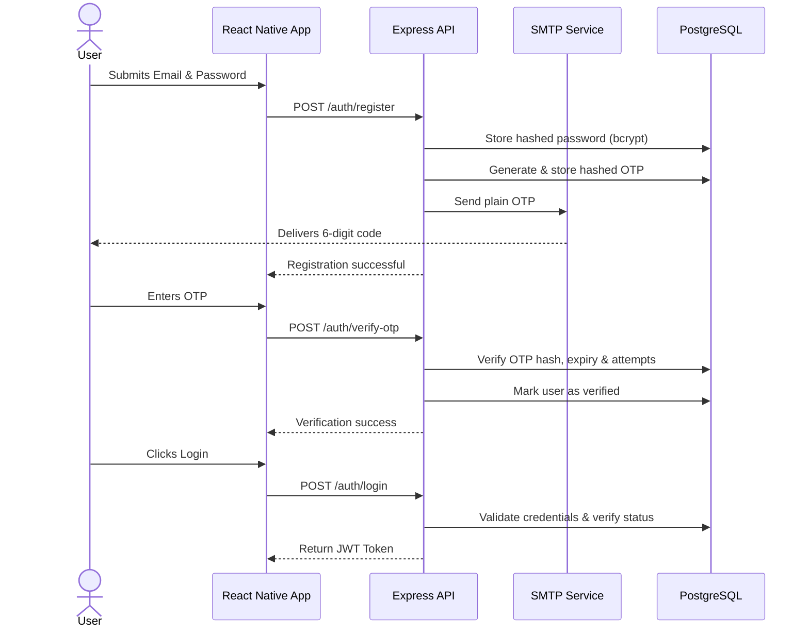
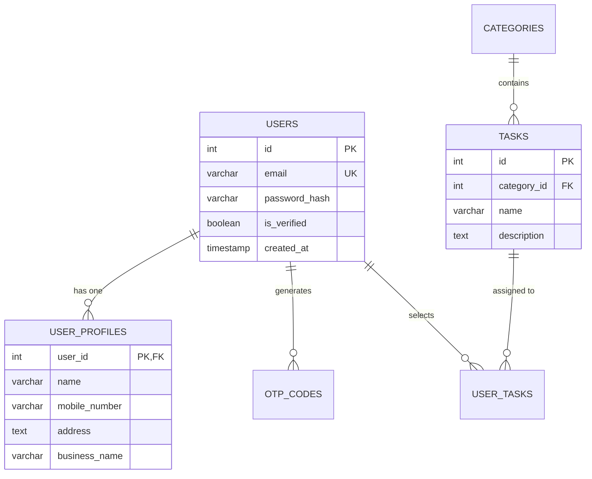

# PadosiPro - Architecture & Design

This document outlines the system architecture, data models, design decisions, and future roadmap for the PadosiPro platform. 

---

## 1. High-Level Architecture

The PadosiPro application follows a decoupled Client-Server model. It consists of a React Native mobile application communicating with a monolithic Node.js/Express backend, backed by a PostgreSQL relational database.

```mermaid
graph TD
    Client[React Native App\n(iOS / Android)] -->|HTTPS / REST| Node[Node.js + Express API]
    
    subgraph Backend Infrastructure
        Node -->|pg driver| DB[(PostgreSQL Database)]
        Node -->|nodemailer| SMTP[SMTP Email Service\nGmail/Ethereal]
    end

    classDef client fill:#e1f5fe,stroke:#01579b,stroke-width:2px,color:#000;
    classDef server fill:#f3e5f5,stroke:#4a148c,stroke-width:2px,color:#000;
    classDef db fill:#e8f5e9,stroke:#1b5e20,stroke-width:2px,color:#000;
    
    class Client client;
    class Node server;
    class DB db;
    class SMTP server;
```

---

## 2. Authentication Flow

Authentication is strictly JWT-based and stateless. To ensure high security and prevent bot signups, the application enforces a strict OTP-based email verification flow before issuing a session token.



---

## 3. Database Schema (ERD)

A relational model was chosen because the platform relies on strict data integrity (e.g., a user's selected tasks must reference valid catalog tasks).



---

## 4. Main Trade-offs & Decisions

1. **Raw SQL (`pg`) vs. ORM (Prisma/TypeORM)**
   - **Decision**: Implemented raw SQL queries using the native `pg` driver.
   - **Trade-off**: Writing raw SQL lacks the automatic type-safety and intellisense provided by modern ORMs like Prisma. However, it completely eliminates abstraction overhead, reduces the build footprint, and provides exact, surgical control over complex queries (like `INSERT ... ON CONFLICT`).

2. **React Context API vs. Global Stores (Redux/Zustand)**
   - **Decision**: Leveraged React's built-in Context API for global state.
   - **Trade-off**: The Context API can trigger unnecessary re-renders in deeply nested trees if not memoized properly. Because the app's global state is currently restricted purely to user authentication (`userToken`, `hasProfile`), pulling in Redux would have added unnecessary boilerplate without providing immediate value.

3. **Cloud Postgres (Neon) vs. Local Docker Dependency**
   - **Decision**: Defaulted to a serverless Postgres instance for active development.
   - **Trade-off**: While a `docker-compose.yml` is provided for strict local setups, relying on a cloud database removes local environment friction (like OS-specific Docker networking issues) and drastically speeds up testing and onboarding.

---

## 5. What Was Left Out

Given the timeframe of the assignment, the following production-grade features were purposefully omitted to focus on core functionality:

- **Rate Limiting**: While OTP attempts are tracked and restricted in the database (max 5), there is no IP-based rate limiting middleware (e.g., `express-rate-limit`) to prevent DDoS attacks on the `/register` endpoint.
- **Refresh Tokens**: The application currently uses a single long-lived JWT. A highly secure architecture would utilize short-lived access tokens alongside HTTP-only refresh tokens.
- **Offline Caching**: The application assumes a persistent network connection. User profiles and selected tasks are not aggressively cached in `AsyncStorage` for offline viewing.

---

## 6. What I Would Do Next (With Another Week)

If allocated another sprint to mature the application, the roadmap would prioritize:

1. **Robust Caching Layer (Redis)**: Transition OTP storage from PostgreSQL to Redis. OTPs are highly transient data with strict expiry times; Redis TTL (Time To Live) is perfectly suited for this and removes unnecessary write-load from the primary Postgres instance.
2. **CI/CD Pipelines**: Implement **GitHub Actions** and Fastlane to automate linting, unit testing, and deployment to TestFlight and Google Play internal testing tracks.
3. **Automated E2E Testing**: Introduce **Detox** to run automated End-to-End user flows on iOS/Android emulators, ensuring that the full registration, OTP, and task selection flows never regress during updates.
4. **Enhanced UI Micro-interactions**: Integrate `react-native-reanimated` to implement 60fps, physics-based micro-interactions across the UI (e.g., fluid layout transitions on the Task Selection screen) to elevate the premium feel of the app.
